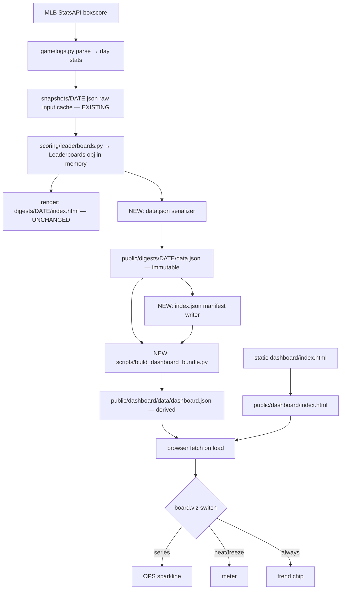

# feat: Dashboard Data Layer + Visual Multi-Tab Dashboard

## Summary

Turn the read-once daily digest into a persistent, highly visual, three-tab dashboard with day-over-day trending, served as a normal GitHub Pages page at `…/mlbreview/dashboard/`. The work is **additive**: a structured JSON data layer (`data.json` per day → `index.json` manifest → rolling `dashboard.json` bundle) carrying stable `player_id`s, plus a single-file vanilla-JS front end that fetches the bundle and renders Scoreboard, Recaps & Moves, and Leaderboards tabs with per-board visuals (OPS sparklines, heat/freeze meters, trend chips).

The existing pipeline (GitHub Actions cron → digest generation → Pages deploy) and the existing human digest at `/digests/YYYY-MM-DD/index.html` stay **byte-for-byte unchanged**.

---

## Problem Frame

The current product emits HTML/text digests only — there is no machine-readable record of a day's digest and no way to show how a player's leaderboard standing moves over time. The durable asset we're missing is **structured data**: an immutable per-day snapshot of the rendered digest, joined across days into a trend bundle. Once that data layer exists, a richer visual surface becomes a thin, dumb front end over a precomputed bundle.

Two scope realities shape the plan:

1. **The data already carries identity.** Research confirmed every leaderboard row the pipeline holds in memory (`LeaderboardHitter`/`LeaderboardPitcher` in `src/mlbreview/scoring/leaderboards.py`) already has a stable MLBAM `player_id`. The build plan's "single biggest risk" (§4 identity resolution) is effectively **resolved** — carrying `player_id` into `data.json` is a pass-through, not an identity task.
2. **The existing dashboard is interactive already.** The CLAUDE.md "no JS" working agreement is already relaxed — `templates/dashboard_day.html.j2` ships tab/sort/expand JS. A richer JS dashboard reading `data.json` is consistent with the existing trajectory, but the new page is a **separate surface** at `/dashboard/`; the existing digest pages are untouched.

---

## Scope Boundaries

**In scope**
- Per-day immutable `data.json` (rendered-digest snapshot), `index.json` manifest, rolling derived `dashboard.json` bundle.
- Stable `player_id` on every leaderboard row and (new) every transaction.
- Standalone bundle builder computing rank deltas, OPS series, and heat/freeze intensity.
- Single-file `/dashboard/` front end: three tabs, per-board viz switch, trend chips, graceful/empty/bootstrap states.
- `jsonschema`-validated schemas for the three JSON artifacts.
- Pipeline wiring and Pages publish of the new artifacts and the static dashboard asset.

**Out of scope / non-goals**
- Any change to the existing email, the existing `/digests/*/index.html` pages, or the existing `/index.html` archive index (must remain byte-for-byte identical).
- Team-bias features (league-neutral is product identity).
- A JS framework, build step, server, or auth — vanilla single-file only.
- Changing leaderboard scoring or windowing math (the bundle **consumes** existing leaderboard output; it does not re-rank).

### Deferred to Follow-Up Work
- **Decision/storyline player ids.** Game `decisions` (winner/loser/save) carry pitcher *names* only, not ids (`src/mlbreview/data/schedule.py`). Storyline play-level `Play.batter_id`/`pitcher_id` already exist. Capturing decision ids is only needed if the dashboard later links decision pitchers to player pages — defer.
- **Full daily OPS series** for sparklines (vs. board-appearance days). v1 uses board-appearance days only (build plan §13.1). Upgrade later if the pipeline retains full daily stats for all qualified players.
- **Stat-scaled intensity** for heat/freeze meters (vs. rank-driven). v1 is rank-driven (build plan §13.2).
- **Inverted cold-board chip polarity.** v1 renders movement neutrally (build plan §13.3).
- **History pruning.** Keep all `data.json` indefinitely — they're tiny and are the long-term time-series asset (build plan §13.4).

---

## Key Technical Decisions

1. **`data.json` is a NEW rendered-digest artifact, distinct from the existing `snapshots/YYYY-MM-DD.json`.** The repo already writes a per-day `snapshots/*.json` (raw stat *input cache*, also on gh-pages, also carries `player_id`, written by `src/mlbreview/data/snapshots.py`). `data.json` is the *rendered-digest* snapshot (scores, storylines, tonight, transactions, leaderboard rows). They coexist; the plan must never collapse them. *(see origin: §3)*

2. **`player_id` is read from the in-memory `Leaderboards` object — no identity resolution.** The serializer reads existing dataclass fields where the pipeline already holds them (`pipeline._write_dashboard`). Resolves the build plan's §4 linchpin.

3. **Trend logic lives ONLY in the standalone bundle builder** (`scripts/build_dashboard_bundle.py`), never in the digest generator. Durability: changing the window (15→10 days) or adding a metric touches one consumer, not history. *(see origin: §3, §10)*

4. **Add `jsonschema` as a dev/test dependency; validate the three artifacts against JSON Schema files in tests.** Per user decision. The repo has no JSON-validation tooling today; this gives a clean, declarative acceptance check ("validates against §5.1").

5. **Trend-math tests are grounded in real captured consecutive June dates,** not synthetic fixtures. Per user decision. Expected deltas are derived once from the real captured data and pinned as test expectations. The build plan's illustrative numbers (Burleson 10→6, Kurtz 2→5, Soderstrom/Wood NEW) are **illustrative only** — actual assertions use values computed from the captured corpus.

6. **The front end is config-driven off `board.viz`** (`series` → sparkline, `heat`/`freeze` → meter, always → chip). No board-specific branching beyond this switch. Adding a board later is a config entry, not new render code. *(see origin: §6.5)*

7. **Preserve the cold-list guards and per-`player_id` dedup.** The recent fix `cc39a94` made hot/cold disjoint with no full-pool fallback and added an absolute composite gate, and dedups swingmen by `player_id`. The bundle consumes already-guarded leaderboards, but its own per-board join must dedup by `player_id` and must not manufacture rows. *(see `docs/formulas.md` "Cold-list selection")*

8. **Idempotency:** `data.json` is **write-once / immutable** (never overwritten once written); `index.json` and `dashboard.json` are **rebuilt every run**. The whole pipeline is already idempotency-guarded across the three daily cron slots (early-exits if `digests/{date}/index.html` exists), so the first slot writes everything and later slots no-op.

9. **The static dashboard asset is copied into `public/dashboard/index.html` at run time**, and `dashboard.json` is written to `public/dashboard/data/dashboard.json`. Both publish via the unchanged `peaceiris/actions-gh-pages@v4` step. *(see origin: §10.4)*

10. **Window labels reflect the real leaderboard windows** (7-day rolling for hot/cold, 15-day for breakout), not the build plan's `"window": "1-day"` example, which predates the implemented windowing in `scoring/leaderboards.py`.

---

## High-Level Technical Design

Two-layer data flow — the data contract is the spine. The digest generator emits a dumb immutable record; the bundle builder owns all derived/trend values; the front end is a dumb renderer over the bundle.



**Bundle trend math (directional, not implementation spec):**

```
for each board, for each row joined by player_id across trailing window:
    prev_rank = rank on SAME board in most-recent-available prior data.json (not necessarily yesterday)
    delta     = prev_rank - rank            # positive = climbed
    is_new    = player absent prior day → prev_rank null, delta 0, chip "NEW"
    series    = [OPS each day on a hitter board], date order, dedup by date   # series boards only
    intensity = (11 - rank) / 10 ; segments = 6 - ceil(rank / 2)              # heat/freeze boards only
    secondary = role-specific stat line string
```

---

## Output Structure

New and modified paths (repo-relative; rendered output under `public/` is gh-pages-only):

```
mlbreview/
├── dashboard/
│   └── index.html                      # NEW: single-file vanilla-JS front end (source)
├── schemas/
│   ├── data.schema.json                # NEW
│   ├── index.schema.json               # NEW
│   └── dashboard.schema.json           # NEW
├── scripts/
│   ├── build_dashboard_bundle.py       # NEW: standalone bundle builder
│   └── capture_fixtures.py             # MODIFIED: capture consecutive June dates
├── src/mlbreview/
│   ├── data/
│   │   ├── transactions.py             # MODIFIED: capture person.id → player_id
│   │   └── digest_data.py              # NEW: data.json serializer + index.json writer
│   └── pipeline.py                     # MODIFIED: wire data.json/index.json/bundle/asset copy
└── tests/
    ├── fixtures/june/                   # NEW: captured consecutive-date corpus
    ├── test_digest_data.py             # NEW
    ├── test_build_dashboard_bundle.py  # NEW
    └── test_transactions.py            # MODIFIED/NEW: player_id capture
```

The per-unit `**Files:**` lists remain authoritative; the implementer may adjust layout (e.g. serializer module name) if a better fit emerges.

---

## Phase A — Data Layer (back end)

### U1. Capture stable `player_id` on transactions

**Goal:** Close the one identity gap in the data model so `data.json` transactions can carry `player_id` per the §5.1 schema.

**Requirements:** Acceptance §14 ("`player_id` on every leaderboard row and transaction"); build plan §5.1 transactions schema.

**Dependencies:** none.

**Files:**
- `src/mlbreview/data/transactions.py` (add `player_id: int | None` to `Transaction`; capture `(raw.get("person") or {}).get("id")` in `parse_transactions`)
- `tests/test_transactions.py`
- `tests/fixtures/transactions_sample.json` (reuse existing; confirm it contains `person.id`)

**Approach:** Additive field on the frozen `Transaction` dataclass; populate from the already-read `person` object. No behavior change to existing transaction rendering — the email/digest templates ignore the new field.

**Patterns to follow:** Mirror the parse/fetch split and frozen-dataclass convention already in `transactions.py`; replay recorded JSON to the parse function (no live network).

**Test scenarios:**
- Happy path: parsing a transaction whose payload has `person.id` yields `Transaction.player_id == <that int>`.
- Edge: payload missing `person` or `person.id` → `player_id is None` (no exception).
- Regression: existing transaction fields (`player_name`, `team_name`, `type`, `detail`) unchanged for the sample fixture.

**Verification:** New field present and populated on parsed sample; full existing transaction test suite green; existing digest HTML output unchanged.

---

### U2. Per-day `data.json` serializer + schema

**Goal:** Emit an immutable per-day `data.json` from the structured data the pipeline already holds, validated against a JSON Schema.

**Requirements:** Build plan §5.1, §10.1; Acceptance §14 ("valid `data.json` with `player_id` on every leaderboard row, validating against §5.1").

**Dependencies:** U1 (transaction `player_id`).

**Files:**
- `src/mlbreview/data/digest_data.py` (NEW: `build_data_json(digest, *, generated_at) -> dict`, `write_data_json(out_dir, date, payload)`)
- `schemas/data.schema.json` (NEW)
- `pyproject.toml` (add `jsonschema` to dev/test deps)
- `tests/test_digest_data.py`

**Approach:** Read scores, storylines, tonight, transactions, and the six leaderboard lists off the in-memory `Digest`/`Leaderboards` dataclasses (`render/pages.py`, `scoring/leaderboards.py`). Map each `LeaderboardHitter`/`LeaderboardPitcher` to the §5.1 `HitterRow`/`PitcherRow` shape. Coerce non-JSON-native types exactly as `snapshots._snapshot_to_dict` does today: `LuckStatus` enum → `.value`, `date` → `.isoformat()`. Set `window` per board to the real leaderboard window (KTD 10): 7-day for hot/cold, 15-day for breakout. Write is **idempotent/write-once**: if `data.json` already exists for the date, do not overwrite.

**Technical design (directional):** exact dataclass→schema field availability (e.g. whether `sb`, `bs`, `sv_pct` are present on every row, defaults for nullable `whip`/`k9`) is an execution-time detail to resolve against the live dataclasses, not pre-specified here.

**Patterns to follow:** `src/mlbreview/data/snapshots.py` (`asdict` + manual coercion + compact `json.dumps`); per-day path convention `public/digests/{date}/`.

**Test scenarios:**
- Happy path: given a fixture `Digest` with populated leaderboards, `build_data_json` returns a dict that **validates against `schemas/data.schema.json`** via `jsonschema`.
- Every leaderboard row carries an integer `player_id`; every transaction carries `player_id` (or explicit null).
- Enum/date coercion: `LuckStatus` serializes to its string value; `meta.date` is ISO `YYYY-MM-DD`; output round-trips through `json.loads` without error.
- `tag` enum values constrained to the §5.1 set (`Comeback`, `Slugfest`, `Pitchers' Duel`, `Walk-off`, `Shutout`, null); `transactions.type` constrained to `IL`/`ACT`/`REC`/`OPT`/`OTHER`.
- Idempotency: calling `write_data_json` when the file exists does not overwrite (assert mtime/content stable).
- Empty/off-day: a digest with zero completed games and empty leaderboards produces a schema-valid `data.json` (empty arrays, not nulls).

**Verification:** `data.json` validates against schema; existing digest HTML byte-identical (golden-file compare of `digests/{date}/index.html` before/after).

---

### U3. `index.json` manifest

**Goal:** Maintain a machine-readable manifest of all available digest dates, newest first.

**Requirements:** Build plan §5.2, §10.2; Acceptance §14 ("`index.json` lists all dates, newest first, with correct `latest`").

**Dependencies:** U2.

**Files:**
- `src/mlbreview/data/digest_data.py` (add `build_index_json(out_dir) -> dict`, `write_index_json`)
- `schemas/index.schema.json` (NEW)
- `tests/test_digest_data.py`

**Approach:** Scan `public/digests/*/` for dirs containing `data.json`, sort dates descending, set `latest` = newest, `updated` = run timestamp. Rebuilt every run (idempotent by construction — derived from the filesystem). Mirror the existing human archive-index builder (`pipeline._build_index_entries`) but emit JSON.

**Patterns to follow:** `pipeline._build_index_entries` (dir scan, newest-first); compact JSON write idiom.

**Test scenarios:**
- Happy path: given 3 digest dirs with `data.json`, manifest lists all 3 dates descending; `latest` = newest; validates against `schemas/index.schema.json`.
- Gap tolerance: non-consecutive dates (an off-day gap) still list correctly, newest first.
- Idempotency: re-running with the same dirs produces identical `dates`/`latest` (only `updated` differs).
- Empty: no digest dirs → valid manifest with empty `dates` and null/absent `latest` (define and test the empty contract).

**Verification:** Manifest validates against schema; ordering correct across a gap fixture.

---

### U4. `dashboard.json` bundle builder (standalone)

**Goal:** Standalone script producing the rolling derived bundle from the trailing 15 `data.json` files, with rank deltas, OPS series, and heat/freeze intensity precomputed.

**Requirements:** Build plan §5.3, §6, §7, §10.3, §11; Acceptance §14 (deltas/series/intensity correct, verified against captured fixtures).

**Dependencies:** U2, U3.

**Files:**
- `scripts/build_dashboard_bundle.py` (NEW: `build_bundle(digests_dir, *, window_days=15) -> dict`, CLI entry so it runs/tests independently)
- `schemas/dashboard.schema.json` (NEW)
- `scripts/capture_fixtures.py` (MODIFIED: capture consecutive in-season dates end-to-end so a real multi-day `data.json` corpus can be produced)
- `tests/fixtures/june/` (NEW: captured corpus → real consecutive-day `data.json` files)
- `tests/test_build_dashboard_bundle.py`

**Approach:** Read the last `window_days` `data.json` per `index.json` (most recent first). For each board, join rows by `player_id`:
- `prev_rank` = rank on the **same board** in the most-recent-available prior `data.json` (fall back through the window; do **not** assume consecutive calendar dates). Absent → `is_new: true`, `prev_rank: null`, `delta: 0`.
- `delta = prev_rank - rank` (positive = climbed).
- `series` (hitter `series` boards only): the player's OPS on each day they appeared on a hitter board, in date order, de-duplicated by date (prefer the shorter-window value when both exist for the same date/board family). Min 2 points to render; otherwise front end shows `NEW` in place of the line.
- `intensity` (heat/freeze boards only): `(11 - rank) / 10`; segment count `6 - ceil(rank / 2)`.
- `secondary`: role-specific formatted string (hitters: `{G} G · {PA} PA · OBP {obp} · SLG {slg}` `· {sb} SB` when >0; relievers: `{APP} APP · {SV} SV · SV% {pct}`; starters: `{GS} GS · WHIP {whip} · K/9 {k9}`).
- Dedup by `player_id` within each board; never manufacture rows (preserve cold-list disjointness — KTD 7).
- Attach per-board `label`, `viz`, `metric`, `columns` config per §5.3.

**Execution note:** Capture the real consecutive-date corpus first, derive the expected delta/series/intensity values from it once, and pin those as test expectations (KTD 5). Test-first against the pinned expectations is appropriate here given the trend math is the highest-value, highest-bug-risk surface.

**Patterns to follow:** `cc39a94` diff to `scoring/leaderboards.py` (disjoint/dedup discipline); role-aware windowing in `docs/formulas.md`; IP `"6.1" = 6⅓` notation handling already in the codebase.

**Test scenarios:**
- *Covers Acceptance §14.* Climber: a player who moved up N spots between two real captured days gets `delta = +N`, green chip semantics; a faller gets `delta = -N`; a held player `delta = 0`.
- New entry: a player on today's board but absent yesterday → `is_new: true`, `prev_rank: null`, `delta: 0`.
- Gap handling: with a missing intermediate day, `prev_rank` falls back to the most recent prior day within the window (assert it does **not** treat the gap as `NEW`).
- Series: a hitter on a `series` board across 3 captured days gets a 3-point OPS series in date order; a hitter appearing once gets <2 points → no line / `NEW`.
- Series dedup: same player/date appearing via two board families de-duplicates to one point with the preferred value.
- Intensity: rank 1 → intensity `1.0`, 5 segments; rank 10 → `0.1`, 1 segment; segment formula `6 - ceil(rank/2)` checked at ranks 1–10.
- Secondary formatting: hitter line includes `SB` only when >0; reliever vs. starter lines use the correct template.
- Dedup: a swingman appearing in two pitcher pools collapses to one row by `player_id`.
- Schema: full bundle validates against `schemas/dashboard.schema.json`.
- Empty/bootstrap: fewer than 2 days available → boards still emit valid rows with `is_new`/no-series; zero `data.json` → valid empty bundle.

**Verification:** Bundle validates against schema; pinned delta/series/intensity expectations from the captured corpus pass; runs standalone (`python scripts/build_dashboard_bundle.py`) independent of the digest generator.

---

### U5. Pipeline integration + static asset publish

**Goal:** Wire `data.json`, `index.json`, `dashboard.json`, and the static dashboard asset into the run, in the additive ordering from §10, without disturbing existing output.

**Requirements:** Build plan §10; Acceptance §14 (existing digest unchanged; dashboard loads on Pages).

**Dependencies:** U2, U3, U4.

**Files:**
- `src/mlbreview/pipeline.py` (extend `_write_dashboard`: after `index.html`, write `data.json`; rebuild `index.json`; build+write `dashboard.json`; copy `dashboard/index.html` → `public/dashboard/index.html`)
- `dashboard/index.html` (referenced; created in U6 — U5 wires the copy step and tolerates its absence until U6 lands)
- `tests/test_pipeline_v2.py` (extend)

**Approach:** Insert the new writes inside the existing `_write_dashboard` so they land in `public/` and publish via the unchanged gh-pages step. Respect the existing idempotency guard (early-exit when `digests/{date}/index.html` exists) — `data.json` write-once is consistent with it. `dashboard.json` and `index.json` rebuild from whatever `data.json` history is present in the checked-out gh-pages `public/`.

**Patterns to follow:** Existing `_write_dashboard`, `_build_index_entries`, and `--out-dir` plumbing; the gh-pages-checked-out-into-`public` model that makes history available.

**Test scenarios:**
- Happy path: a full pipeline run (against fixtures) writes `digests/{date}/data.json`, refreshes `index.json`, writes `dashboard/data/dashboard.json`, and copies `dashboard/index.html`.
- Existing digest HTML and email output unchanged by the new steps (golden-file compare).
- Idempotency: a second run for the same date no-ops (early-exit) and does not overwrite `data.json`.
- Off-day: zero-games path still produces a schema-valid `data.json` and a bundle (empty boards), no exception.
- Missing static asset: if `dashboard/index.html` is absent, the run logs and continues (does not crash the digest).

**Verification:** Full run produces all four artifacts under `public/`; existing outputs byte-identical; idempotent across repeated slots.

---

## Phase B — Front End (dashboard)

### U6. Dashboard shell + Scoreboard tab

**Goal:** Single-file vanilla-JS front end that fetches `dashboard.json` once, renders tab chrome and graceful states, and implements the Scoreboard tab.

**Requirements:** Build plan §2, §8 (Scoreboard), §9; Acceptance §14 (loads, fetches, renders tabs; scoreboard tags).

**Dependencies:** U4 (bundle shape). Front-end render can be built against a committed sample `dashboard.json` before U5 is live.

**Files:**
- `dashboard/index.html` (NEW: HTML + CSS + JS, no framework, no build step)
- `tests/fixtures/sample_dashboard.json` (NEW: a small committed bundle for front-end/dev)

**Approach:** On `DOMContentLoaded`, `fetch('./data/dashboard.json')` (one request). Tab switching mirrors the existing `dashboard_day.html.j2` JS idioms. Scoreboard: one card per game, away-over-home, winner emphasized / loser muted, team-color accent bar (abbreviation→hex map), footer strip with `Final` and the storyline `tag` chip when present. Graceful states: missing/empty bundle or empty board → empty-state message, not a throw; a "building up data" notice when history is thin (mirror the existing <7-snapshot convention). Reuse the existing luck-badge color language for chips/meters rather than inventing a second palette.

**Patterns to follow:** `templates/dashboard_day.html.j2` (tab/sort/expand JS, CSS idioms); existing team-color/luck-badge conventions; light theme, tabular numerics, responsive grid.

**Note (assumption):** The build plan §9 references an existing mockup `mlb-review-dashboard.html` as "~70% of the client." **That file is not in the repo** — the front end is built fresh here, reusing in-repo idioms. If the user supplies the mockup, port from it instead. *(see Open Questions)*

**Test scenarios:** (front-end verification is screenshot/behavior-based, not unit tests)
- Loads against `sample_dashboard.json`; three tabs present; Scoreboard renders one card per game with winner emphasized.
- `Comeback`/`Slugfest`/`Pitchers' Duel` tag chips render on the tagged games.
- Empty state: bundle with empty `scores` → empty-state message, no console error.
- Missing bundle: failed fetch → graceful empty state, not a blank/broken page.
- Test expectation: covered by manual/Playwright verification in U9; no Python unit tests for the static asset.

**Verification:** Page renders all three tab headers and a correct Scoreboard from the sample bundle with no console errors.

---

### U7. Recaps & Moves tab

**Goal:** Render storyline cards, a distinct "Tonight" card, and parsed roster moves.

**Requirements:** Build plan §8 (Recaps & Moves).

**Dependencies:** U6.

**Files:**
- `dashboard/index.html` (extend)

**Approach:** Storyline cards (matchup, score, tag, body); a visually distinct "Tonight" card with a broadcast pill; transactions rendered with a colored type tag (IL red, Activated green, Recall blue), grouped or sorted by type.

**Patterns to follow:** Card/chip styling established in U6; transaction type→color mapping consistent with the luck-badge palette family.

**Test scenarios:**
- Storyline cards render matchup/score/tag/body from `storylines`.
- Tonight card renders with broadcast pill from `tonight`.
- Transactions render with correct type-tag colors; type enum (`IL`/`ACT`/`REC`/`OPT`/`OTHER`) all map to a tag.
- Empty transactions/storylines → empty-state, no throw.
- Test expectation: covered by manual/Playwright verification in U9.

**Verification:** Tab renders all three sections from the sample bundle; type tags colored correctly.

---

### U8. Leaderboards tab + config-driven viz switch

**Goal:** Render all six boards with trend chips, the per-board right-column visual (sparkline / heat / freeze), and full stat detail — driven solely by `board.viz`.

**Requirements:** Build plan §6, §7; Acceptance §14 (sparklines for hot/breakout hitters, heat for hot/breakout pitchers, freeze for cold hitters/pitchers; all six show chips; full stat detail retained).

**Dependencies:** U6 (shell), U4 (bundle viz fields).

**Files:**
- `dashboard/index.html` (extend)

**Approach:** Config-driven render — `if viz=="series" → sparkline(row.series); if viz=="heat" → meter(row.intensity, "heat"); if viz=="freeze" → meter(row.intensity, "freeze"); always → chip(row.delta, row.is_new)`. No board-specific branching beyond this switch.
- **Trend chip:** `delta>0` green `▲N`; `delta<0` red `▼N`; `delta==0` gray `—`; `is_new` blue `NEW`. Cold boards render movement **neutrally** (no inverted colors in v1).
- **Sparkline:** inline SVG ~54×18px, OPS chronological; last point dotted; line green if last≥first else red; <2 points → `NEW` chip in place of line.
- **Heat/freeze meter:** 5-segment meter + flame/snowflake glyph; segments = `6 - ceil(rank/2)`; warm (amber→red) / cool (blue) gradients; can also read continuous `intensity`.
- **Tables:** retain full detail — hitters `Trend · Rank+Player+Team · AVG · HR · RBI · **OPS** · Viz` with secondary line; pitchers `Trend · Rank+Player+Team · ERA · IP · K · Role · Viz` with secondary line. Tabular-aligned numerics; OPS/ERA emphasized.

**Patterns to follow:** §6.5 front-end contract; existing column-sort/expand JS; tabular-numeric CSS.

**Test scenarios:**
- Hot Hitters and Breakout Hitters render OPS sparklines; Hot/Breakout Pitchers render heat meters; Cold Hitters/Pitchers render freeze meters; all six render trend chips.
- Chip variants: climber green ▲, faller red ▼, held gray —, new blue NEW — each renders from the corresponding `delta`/`is_new`.
- Sparkline edge: 1-point series → NEW chip instead of a line; flat series → correct color rule.
- Meter edge: rank 1 → 5 filled segments; rank 10 → 1 segment.
- Full stat detail: hitter secondary line shows G/PA/OBP/SLG (and SB when >0); pitcher secondary shows the role-correct line.
- Empty board → empty-state message.
- Test expectation: covered by manual/Playwright verification in U9.

**Verification:** All six boards render the correct viz and chips from the sample bundle; viz switch has no per-board special-casing.

---

## Phase C — Ship

### U9. Deploy verification, mobile pass, and polish

**Goal:** Confirm the live Pages deploy serves the dashboard correctly, pass mobile, and verify graceful states end-to-end.

**Requirements:** Build plan §4 (Phase 4), §9 graceful states; Acceptance §14 (public, no auth, current on load).

**Dependencies:** U5, U6, U7, U8.

**Files:**
- `.github/workflows/digest.yml` (verify `public/dashboard/` is published; adjust only if the whole-`public/` publish does not already cover it)
- `dashboard/index.html` (polish only)
- `docs/architecture.md` (note the new data layer + dashboard surface)

**Approach:** Verify a real run publishes `/dashboard/` and `/dashboard/data/dashboard.json`, that the live page fetches the bundle (unrestricted `fetch` on Pages), and that mobile collapses to single-column score grid and stacked tables. Confirm empty/bootstrap states on a thin-history day. Browser-drive verification with Playwright (available in this environment).

**Patterns to follow:** Existing `peaceiris/actions-gh-pages@v4` publish (whole `public/` tree — likely already covers `dashboard/`); the "building up data" bootstrap convention.

**Test scenarios:**
- Live (or local-served) page at `…/dashboard/` fetches `dashboard.json` and renders all three tabs with no console errors.
- Mobile viewport: score grid single-column, tables stack, no horizontal overflow.
- Thin-history day: bootstrap/empty states render instead of broken visuals.
- Workflow publishes `dashboard/index.html` and `dashboard/data/dashboard.json`.
- Test expectation: Playwright/manual verification; no new Python unit tests.

**Verification:** Public URL loads with no auth, renders current data on load, passes mobile, and degrades gracefully on thin history.

---

## Acceptance Criteria (traceability to build plan §14)

- Existing daily digest HTML is **byte-for-byte unchanged** by the new steps — *U2, U5 golden-file checks*.
- Each day produces a valid `data.json` with `player_id` on every leaderboard row, validating against §5.1 — *U2*.
- `index.json` lists all dates, newest first, with correct `latest` — *U3*.
- `dashboard.json` regenerates each run with correct deltas, series, and intensity, verified against the captured fixtures — *U4*.
- The dashboard loads at `…/mlbreview/dashboard/`, fetches `dashboard.json`, and renders all three tabs — *U6–U9*.
- Hot/Breakout Hitters show OPS sparklines; Hot/Breakout Pitchers show heat meters; Cold Hitters/Pitchers show freeze meters; all six show trend chips — *U8*.
- Scoreboard shows `Comeback`/`Slugfest` tags; leaderboards retain G/PA/OBP/SLG (hitters) and appearance/WHIP/K9 detail (pitchers) — *U6, U8*.
- Page is public, no auth, current on load, no desktop-app dependency — *U9*.

---

## Open Questions

1. **Missing mockup.** Build plan §9 cites `mlb-review-dashboard.html` as an existing ~70%-complete client; it is not in the repo. **Assumption:** build the front end fresh from in-repo idioms (U6). If the user has the mockup, supplying it changes U6 from build-fresh to port.
2. **Window-label semantics.** The §5.1 example uses `"window": "1-day"`, but the implemented leaderboards use 7-day (hot/cold) / 15-day (breakout) calendar windows. The plan adopts the real window labels (KTD 10); confirm this matches intent before the schema is frozen.
3. **Decision/storyline player ids.** Game decisions carry pitcher names only. Deferred unless the dashboard later links decision pitchers to players.
4. **Capture-date selection.** Which specific consecutive in-season dates to capture for the trend corpus (U4) is an execution-time choice — pick a stretch with real rank movement and at least one off-day gap to exercise the fallback path.

---

## Risks & Mitigations

- **Trend-math correctness** (highest risk): mitigated by real captured-corpus fixtures with pinned expectations, test-first in U4, and explicit gap/dedup/NEW scenarios.
- **Accidentally mutating the existing digest**: mitigated by golden-file byte-compares in U2/U5 and keeping all new writes purely additive inside `_write_dashboard`.
- **Idempotency across three cron slots**: mitigated by write-once `data.json`, rebuilt-from-filesystem `index.json`/`dashboard.json`, and the existing early-exit guard.
- **Cold-list regression** (the `cc39a94` class of bug): mitigated by consuming already-guarded leaderboards and dedup-by-`player_id` in the bundle; re-read the fix before writing the join.
- **Schema drift between serializer and front end**: mitigated by a single `jsonschema`-validated contract that both the bundle builder and a committed sample bundle conform to.

---

## Sources & Research

- Origin: `Desktop/MLB_Review_Dashboard_Build_Plan.md` (June 15, 2026).
- Repo research: leaderboard `player_id` confirmed present end-to-end (`src/mlbreview/scoring/leaderboards.py`, `src/mlbreview/data/snapshots.py`, `gamelogs.py`); transactions drop `person.id` (`data/transactions.py`); gh-pages publishes whole `public/` via `peaceiris/actions-gh-pages@v4` (`.github/workflows/digest.yml`); no `jsonschema` dep; fixtures are Aug 2025, no June fixtures exist.
- Learnings: cold-list disjoint/dedup guards (`cc39a94`, `docs/formulas.md`); role-aware windows and Statcast-as-luck-filter (`docs/formulas.md`, `docs/architecture.md`); static-dashboard interaction budget and "building up data" bootstrap state (`docs/architecture.md`); fixture parse/fetch split (`tests/fixtures/README.md`).
